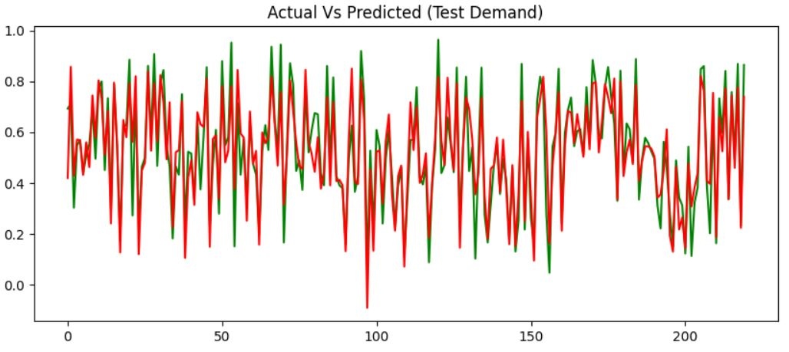

 Data Science Portfolio
---
## Machine learning

### AI Powered Invoice Processing

Led development of end-to-end AI-powered invoice processing, leveraging NLP, OCR, and RPA technologies, resulting in 5000+ man-hours saved and a 90% improvement in efficiency.

---
### Time Series Demand Forecasting

Collaboratively developed a highly accurate multivariate demand forecasting model with BCG, utilizing tree-based ensemble models, feature engineering, and hyperparameter tuning. Achieved 80-85% forecast accuracy, resulting in reduced inventory levels, minimized backorders, and enhanced production planning efficiency.

---
### Deep Learning for Dermatology: Melanoma Detection with CNNs

The project aims to build a CNN-based model for accurately detecting melanoma, a type of skin cancer responsible for 75% of skin cancer deaths, which can be deadly if not detected early. An automated solution that evaluates images and alerts dermatologists about the presence of melanoma has the potential to significantly reduce manual diagnostic efforts. The model achieved accuracy of 90% after addressing class imbalance through data augmentation. Technologies used include numpy, skimage, keras and tensorflow. The project steps involved data reading and understanding, dataset creation and visualization, model building and training, analyzing model overfit/underfit, applying data augmentation to resolve class imbalances, and training a final CNN model to accurately detect nine classes of melanoma.

---
### Sterilization Chamber Capacity Utilization Across BDX

Designed and implemented a forecasting algorithm for sterilization chamber capacity across 30 manufacturing sites, utilizing time series analysis techniques, ARIMA, and SARIMA models, resulting in a significant 40% improvement in Overall Equipment Efficiency (OEE).

---
### Bike Sharing Demand Problem

Build a Multiple linear regression model to solve bike sharing problem for a company. We are required to build a shared bikes demand model with the available independent variables. It will be used by the management to understand how exactly the demands vary with different features. They can accordingly manipulate the business strategy to meet the demand levels and meet the customer's expectations. Further, the model will be a good way for management to understand the demand dynamics of a new market.

---
### Lending Club CaseStudy

Lending company wants to understand the driving factors (or driver variables) behind loan default, i.e. the variables which are strong indicators of default. The company can utilize this knowledge for its portfolio and risk assessment. This is an assignment provided by IIT B Upgrad program, It will give an idea about how real business problems are solved using EDA. In this case study, apart from applying the techniques i have learnt in EDA, I have also developed a basic understanding of risk analytics in banking and financial services and understand how data is used to minimise the risk of losing money while lending to customers.
The dataset is obtained from lending club portal. It contains the complete loan data for all loans issued through the time period 2007 t0 2011.

---

### User's Account Provisioning/Deprovisioning

Led a cross-functional team in implementing an end-to-end user account management automation solution, leveraging UiPath (RPA tool) and data analysis techniques to improve efficiency. Achieved a significant 60% increase in operational efficiency by eliminating manual tasks, reducing processing time, and optimizing user account management processes.

---

